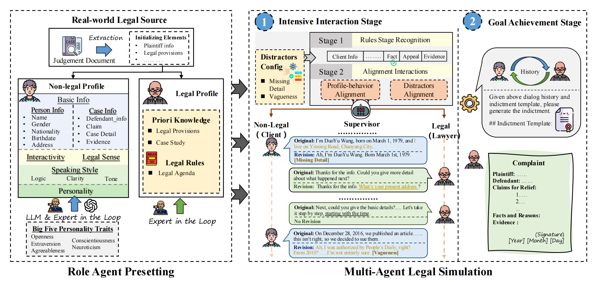

# [NAACL 2025] Multi-Agent Simulator Drives Language Models for Legal Intensive Interaction [[Paper]](https://arxiv.org/abs/2502.06882)

ShengbinYue*, Ting Huang*, Zheng Jia*, Siyuan Wang, Shujun Liu, Yun Song, Xuanjing Huang, Zhongyu Wei

The Multi-agent Legal Simulation Driver (MASER), a legal-specific simulator that serves as data-generation engine, empowering arbitrary LLMs with intensive interaction capabilities.



In this repository, we will release:

- Multi-agent Legal Simulation Driver (MASER)
- The constructed [SynthLaw-4.5k Dataset](https://huggingface.co/datasets/ShengbinYue/SynthLaw).
- Training scripts.
- Multi-Stage Interactive Legal Evaluation (MILE) Benchmark.


## Content 
1. [MASER](#maser)
2. [Training](#training)
3. [MILE Benchmark](#mile-benchmark)
4. [Citation](#citation)

## MASER

### Environment Setup
To set up your environment, run the following command:
```
pip install -r requirements.txt
```

### Profile data Constrction 
The agent profiles setup with Big-5 Personality Traits and Real Legal Source. You can follow [this step](src/data/) to obtain the data by prompt the GPT-4o.

You can get the final [processed data here](src/data/legal.json)

### Run MASER

Navigate to the source directory:
```
cd ./src
```
Before running the script, open `scripts/run.sh` and enter your API keys for the required services. For instance:
- For OpenAI Models (e.g., GPT-4): `OPENAI_API_KEY=""`, `OPENAI_API_BASE=""`

Execute the script with:
```
bash scripts/run.sh
```
You can find the dialog history documents of LLMs featured  at [Dialog_History](src/outputs/dialog_history/). 

## Training 
Using MASER, we construct a high-quality synthetic legal scene dataset, [SynthLaw-4.5k](https://huggingface.co/datasets/ShengbinYue/SynthLaw).

```
[
  {
    "id": 1,
    "system": "你是一位专业且经验丰富的律师...",
    "input": "请根据上述与用户的对话历史，参照给定的起...",
    "instruction": "请根据上述与用户的对话历史...",
    "history": [
      ["您好，我想写一份起诉状", "好的，没问题！我这边需要先问您一些问题，了解一下相关情况。"],
      ["当然可以，我已经准备好了。请问您想先了解哪个方面？", "我们先从您的基本信息开始吧。请问您的姓名、性别、出生日期、民族和地址是什么？"],
      ......
    ]
  }
]
```

To fine-tuning LLM on SynthLaw-4.5k, you can refer to [LLaMA Factory](https://github.com/hiyouga/LLaMA-Factory). 
First, download [LLaMA Factory](https://github.com/hiyouga/LLaMA-Factory) and follow its instructions to install the required dependencies. Note that the training data should be processed in the [Supervised Fine-Tuning Dataset format](https://github.com/hiyouga/LLaMA-Factory/tree/main/data) specified by the project.

```
cd train
git clone --depth 1 https://github.com/hiyouga/LLaMA-Factory.git
cd LLaMA-Factory
pip install -e ".[torch,metrics]"
```

Take the [Qwen2.5-7B-Instruct](https://huggingface.co/Qwen/Qwen2.5-7B-Instruct) as example, use the following 2 commands to run LoRA fine-tuning and merging, respectively.

```
llamafactory-cli train ../qwen_lora_sft.yaml
llamafactory-cli export ../merge_qwen_lora.yaml
```

## MILE Benchmark 
Multi-Stage Interactive Legal Evaluation (MILE) introduces an approach for assessing the model’s ability to complete designated legal tasks in a dynamic environment. Leveraging powerful LLM to simulate the non-legal characters (i.e., Client), MILE thoroughly evaluates the performance of LLMs driven lawyer within this dynamic legal interaction environment. MILE is divided into two phases: interaction evaluation and goal evaluation.

Please see [evaluation](https://github.com/FudanDISC/MASER/tree/main/src/evaluation) for details about the evaluation datasets and evaluation scripts.
### Evaluation

## Citation

We encourage the use of our code and data in your research and kindly request citation of our paper as follows:

```BibTeX
@article{yue2025multi,
  title={Multi-Agent Simulator Drives Language Models for Legal Intensive Interaction},
  author={Yue, Shengbin and Huang, Ting and Jia, Zheng and Wang, Siyuan and Liu, Shujun and Song, Yun and Huang, Xuanjing and Wei, Zhongyu},
  journal={arXiv preprint arXiv:2502.06882},
  year={2025}
}
```
